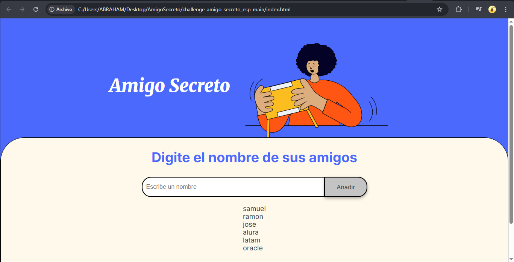
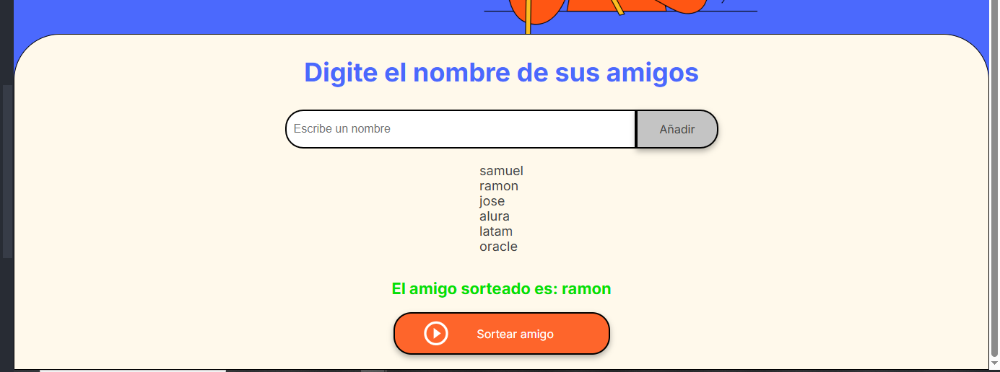

# Amigo Secreto

¡Bienvenido al proyecto **Amigo Secreto**! Esta es una aplicación web sencilla para organizar el juego del amigo secreto. Podrás agregar nombres de tus amigos y, con un sorteo aleatorio.

---

## 📋 Funciones

- **agregarAmigo()**  
  Ingresa los nombres de tus amigos en el campo de texto y haz clic en "Añadir" para agregarlos a la lista.

- **imprimeAmigo()**  
  La lista de amigos se muestra en la pantalla y se actualiza cada vez que agregas un nuevo nombre.

- **sortearAmigo()**  
  Con un clic en "Sortear amigo", se seleccionará de forma aleatoria uno de los nombres de la lista.  

---

## 💻 Tecnologías Utilizadas

- **HTML5**
- **CSS3**
- **JavaScript**

---

## 🚀 Cómo Empezar

1. **Descarga o clona el repositorio:**

    ```bash
    git clone https://github.com/samuelz01/amigo-secreto.git
    ```

2. **Abre el archivo `index.html`:**  
   Puedes hacerlo directamente en tu navegador.

3. **Prueba la aplicación:**  
   - Agrega algunos nombres usando el campo de entrada.
   - Haz clic en "Sortear amigo" y observa el resultado en pantalla.

---

## 📸 Capturas de Pantalla

### Agregar Nombres
  
*Visualización de la sección para añadir nombres.*

### Realizar el Sorteo

*Visualización del resultado del sorteo.*

---
¡Gracias por visitar el proyecto **Amigo Secreto**!  
By: Samuel Perez
